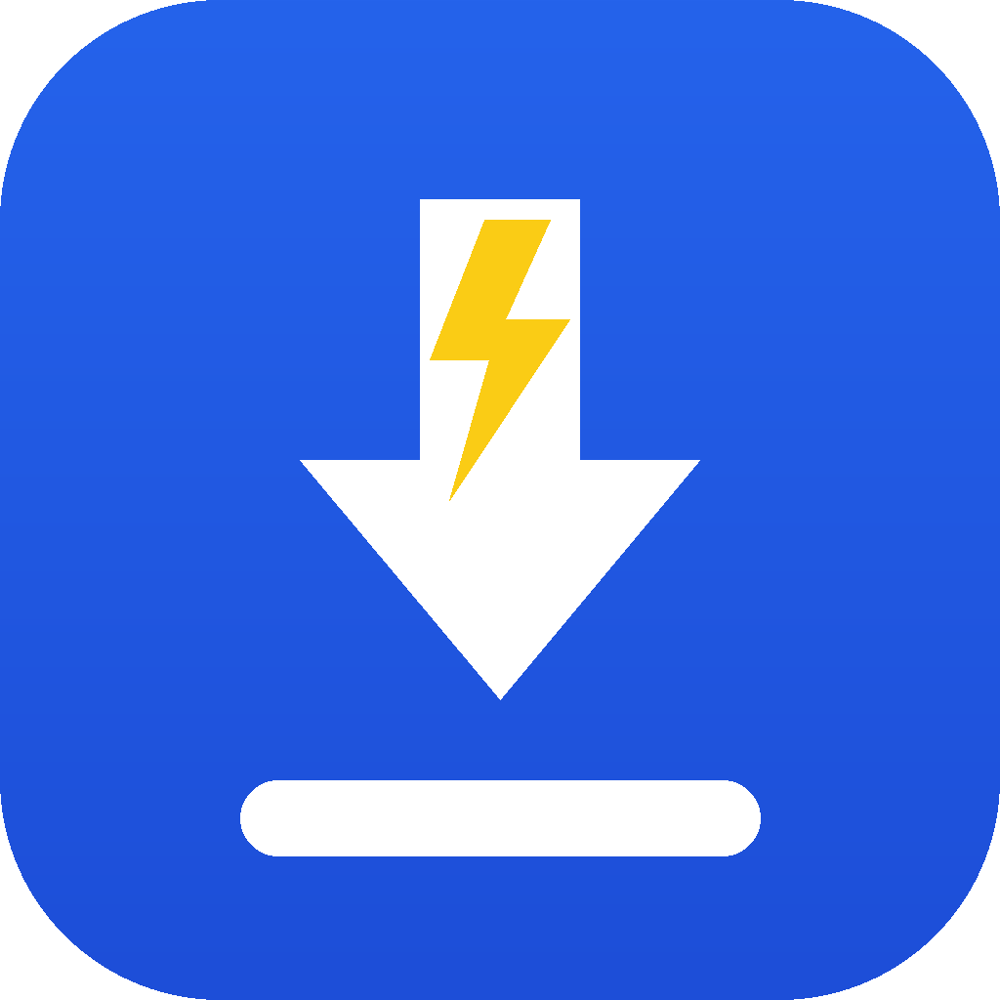

<div align="center">



# IDM No Ads

**Free · No Ads · No Watermark · Forever.**
A full Internet Download Manager clone for Windows — segmented multi-connection
downloads, browser integration, scheduler, categories. Built with Tauri 2 + Rust
+ aria2.

*Day 7 of the 365 Days App Challenge — by Ir. Riovan Styx Roring.*

</div>

---

## ✨ Features

- **Segmented downloads** via the [aria2](https://aria2.github.io/) engine
  (up to 32 connections per file) — HTTP/HTTPS, FTP, SFTP, BitTorrent & Magnet.
- **Download queue** with progress bars, speed, ETA, pause/resume/cancel/restart.
- **Categories** (General, Videos, Music, Documents, Programs, Compressed) with
  auto-sort by file type.
- **Browser integration** — right-click any link → *Download with IDM No Ads*,
  automatic download capture, and "grab all media on this page" (Chrome, Edge,
  Brave, Opera, Vivaldi, Firefox).
- **Scheduler** with speed limit and time windows.
- **Settings** — simultaneous downloads, per-file connections (1–32), default
  folder, proxy, speed limit.
- **System tray** + minimize to tray + start on Windows startup.
- **Drag & drop** a URL or `.torrent` onto the window.
- **Auto-capture clipboard URLs** (optional).
- **Real-time download speed graph**.
- **Dark / Light mode**, **English / Bahasa Indonesia**.

## 🏗️ Architecture

Exactly like the real IDM — four cooperating pieces:

```
┌──────────────────┐   named pipe    ┌─────────────────────┐   JSON-RPC    ┌──────────┐
│ Browser extension│ ─ native msg ─▶ │ idmnoads-host.exe    │ ───────────▶ │ Tauri app │
│ (Chromium/FF MV3)│                 │ (native messaging)   │  \\.\pipe\    │ + aria2c  │
└──────────────────┘                 └─────────────────────┘   idmnoads    └──────────┘
                                                                                  │ HTTP
                                                                                  ▼
                                                                          127.0.0.1:6800
```

1. **Desktop app** — `src-tauri/` (Rust) + `src/` (Material-design web UI).
2. **Download engine** — `aria2c.exe` launched as a Tauri sidecar with a private
   RPC secret; the backend drives it over JSON-RPC.
3. **Native messaging host** — `native-host/` builds `idmnoads-host.exe`, which
   bridges the browser extensions to the app over the `\\.\pipe\idmnoads` named pipe.
4. **Browser extensions** — `chromium-extension/` and `firefox-extension/`
   (both Manifest V3).

## 📦 Download / Install

Grab the latest build from the [**Releases**](../../releases) page or from the
**Actions → latest run → Artifacts**:

| File | Use |
| ---- | --- |
| `IDMNoAds-setup.exe` | **Recommended.** NSIS installer (per-user). Installs the app, `aria2c.exe`, the native host, and registers browser integration. |
| `IDMNoAds.msi` | MSI installer (basic). |
| `IDMNoAds-chrome-extension.zip` | For Chrome Web Store / Edge Add-ons / Opera. |
| `IDMNoAds-firefox-extension.zip` | For Firefox AMO. |

### ⚠️ SmartScreen / "Unknown publisher"

The installer is **unsigned** (a code-signing certificate costs $100–400/year).
Windows SmartScreen will warn *"Windows protected your PC / Unknown publisher."*
This is expected. Click **More info → Run anyway**. Get the certificate later and
it goes away.

On a fresh Windows install the **WebView2 runtime** is required; the NSIS
installer downloads it automatically if missing.

## 🧩 Browser extension setup (developer / sideload)

Until the extensions are approved on the stores you can load them unpacked:

- **Chrome/Edge/Brave:** `chrome://extensions` → enable *Developer mode* →
  *Load unpacked* → select `chromium-extension/`.
- **Firefox:** `about:debugging` → *This Firefox* → *Load Temporary Add-on* →
  select `firefox-extension/manifest.json`.

Then open the app → **Settings → Advanced**, copy the **aria2 RPC secret**, and
paste it into the extension's **Options** so the popup can show your live queue.

The extension IDs are **pinned** so they always match the native-host manifest:

- Chromium: `ikbamigoaahjngjceemkppoimlphgmii` (pinned via the `key` field).
- Firefox: `idmnoads@hostingrakyat` (pinned via `gecko.id`).

## 🛠️ Building locally (Windows)

Prerequisites: Rust (stable), Node 24, the WebView2 runtime, and the Tauri CLI.

```powershell
# 1. aria2 sidecar
#    Download aria2 1.37.0 win-64bit and copy aria2c.exe to:
#    src-tauri/binaries/aria2c-x86_64-pc-windows-msvc.exe

# 2. Native messaging host
cargo build --release --manifest-path native-host/Cargo.toml
copy native-host\target\release\idmnoads-host.exe src-tauri\binaries\idmnoads-host-x86_64-pc-windows-msvc.exe

# 3. Build the app (produces MSI + setup.exe)
npm install -g @tauri-apps/cli@^2
tauri build
```

Output: `src-tauri/target/release/bundle/{nsis,msi}/`.

CI (`.github/workflows/build.yml`) does all of this on `windows-latest` and
publishes the artifacts + a GitHub Release.

## 🚀 Publishing the extensions

See [`PUBLISHING.md`](PUBLISHING.md) for step-by-step store submission
(Chrome Web Store, Edge Add-ons, Firefox AMO, Opera).

## 🔒 Privacy

IDM No Ads collects **nothing**. No analytics, no accounts, no servers. See
[`PRIVACY.md`](PRIVACY.md).

## 👤 Credits

Created by **Ir. Riovan Styx Roring** — lecturer at Institut Teknologi Kalimantan.

- TikTok: <https://www.tiktok.com/@ir.riovansroring>
- Instagram: <https://www.instagram.com/ir.riovansroring/>
- YouTube: <https://youtube.com/@ir.riovanroring>

## 📄 License

[MIT](LICENSE). Free forever.
